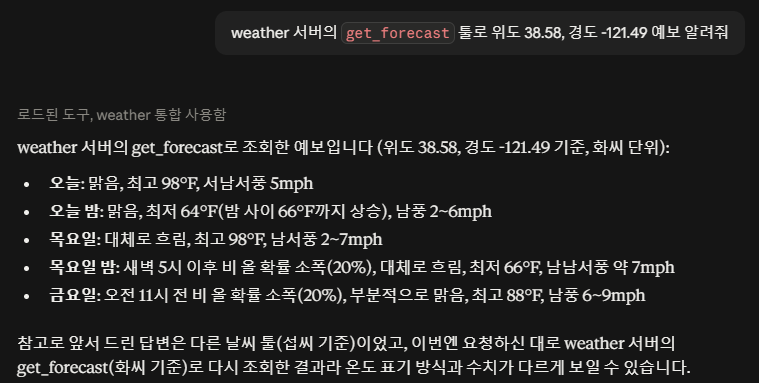
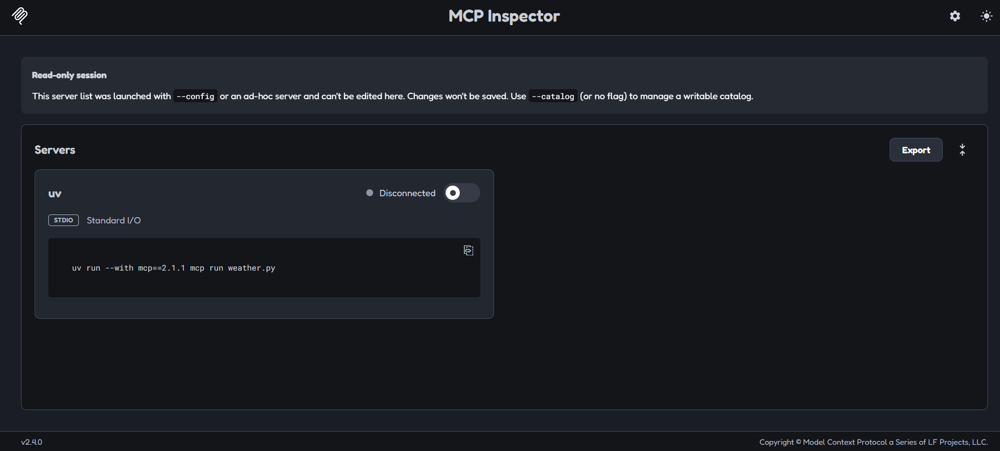
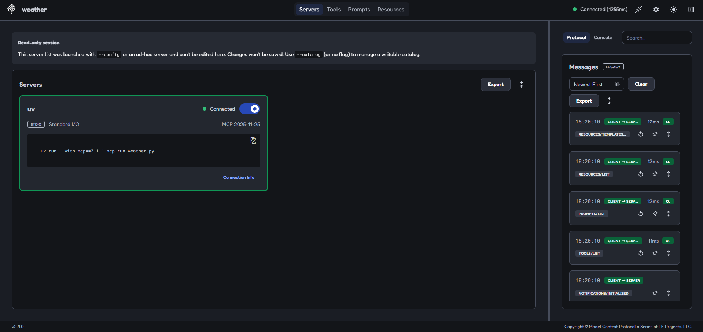
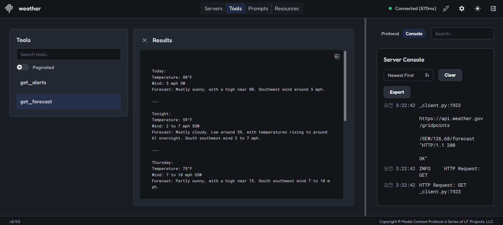

## 환경설정

### 1. 폴더 생성

```bash
uv init weather # weather 이름의 파이썬 프로젝트 폴더 생성
cd weather # weather 폴더로 이동
```

### 2. 가상환경 생성 후 활성화

```bash
uv venv # 프로젝트 전용 독립된 파이썬 가상환경 생성
.venv\Scripts\activate # 방금 만든 가상환경에 있는 Scripts 폴더의 activate 실행
```

- `.venv\Scripts\activate`를 하고나면 프롬프트 맨 앞에 `(weather)`가 붙음: weather 프로젝트의 파이썬 가상환경이 정상적으로 활성화되었다는 것을 알려주는 표시

### 3. 의존성 패키지(필요 라이브러리) 설치

```bash
uv add "mcp[cli]" # 프로젝트에 MCP 개발용 패키지와 터미널 명령어(CLI) 도구 추가 및 설치 (셸에서 [ ] 가 글로브로 해석되지 않게 따옴표)
```

### 서버 파일 생성

```bash
new-item weather.py # 폴더에 weather.py 라는 이름의 빈 파일 생성
```

## 서버 구축

### weather.py 에 코드 추가

```python
from typing import Any
import httpx2
from mcp.server import MCPServer

# MCP 서버 초기화
# weather라는 이름을 가진 MCP 서버 객체(인스턴스) 생성
mcp = MCPServer("weather")

# 상수 설정
NWS_API_BASE = "https://api.weather.gov" # 미국 국립기상청(NWS) API의 기본 주소
USER_AGENT = "weather-app/1.0" #  API 요청 시 전달할 식별용 이름(User-Agent)
```

### 헬퍼 함수

미국 국립기상청 API에서 데이터 조회하고 형식 지정하는 데 필요한 도우미 함수 추가

```python
# 미국 기상청 API 서버에 접속해서 필요한 데이터 가져오는 비동기 통신 함수
# url: str: 요청할 기상청 웹 주소 문자열로 받기
# -> dict[str, Any] | None: 성공하면 기상 정보 데이터(딕셔너리 형태)를 반환, 실패하면 None 반환
async def make_nws_request(url: str) -> dict[str, Any] | None:
    """예외 처리가 적용된 미국 기상청(NWS) API 요청 함수"""
    # 미국 국립기상청 API를 만든 개발팀(서버 제공자)이 정해둔 호출 규칙
    # 접속하는 API 서버가 어디냐에 따라 안에 들어가는 내용이 다 달라짐
    headers = {"User-Agent": USER_AGENT, "Accept": "application/geo+json"}
    # HTTP 요청을 비동기로 보내기 위한 통신 객체 생성
    async with httpx2.AsyncClient() as client:
        try:
            # 기상청 웹 서버에 접속하여 데이터 받아오는 비동기 명령어
            response = await client.get(url, headers=headers, timeout=30.0)
            # 서버 응답 결과가 실패라면, 파이썬 예외 강제로 발생
            response.raise_for_status()
            # 서버가 준 JSON 데이터를 파이썬 객체로 변환
            return response.json()
        except Exception:
            return None

# 재난이나 날씨 등의 경보 데이터를 사람이 읽기 쉬운 문자열 형태로 변환
def format_alert(feature: dict) -> str:
    """경보 데이터를 사람이 읽기 쉬운 문자열 형태로 변환"""
    # feature은 복잡한 딕셔너리 구조로 들어오기 때문에 데이터 꺼낼 때마다 매번 길게 적어야함
    # -> 간단하게 꺼내오기 위해 props에 미리 저장
    props = feature["properties"]
    return f"""
Event: {props.get("event", "Unknown")}
Area: {props.get("areaDesc", "Unknown")}
Severity: {props.get("severity", "Unknown")}
Description: {props.get("description", "No description available")}
Instructions: {props.get("instruction", "No specific instructions provided")}
"""
```

### 도구 실행 구현

```python
# 이 함수를 AI(LLM)가 호출해서 쓸 수 있는 도구로 등록
@mcp.tool()
async def get_alerts(state: str) -> str:
    # AI는 코드를 직접 실행하기 전 이 설명서 읽고 동작 이해
    # "내가 미국 주 코드(예: CA, NY)를 문자열로 넘겨주면
    # 해당 지역의 기상 경보 정보를 찾아서 문자열로 알려주는 
    # get_alerts라는 비동기 도구를 등록해줘" 라고 정의하는 구간
    """Get weather alerts for a US state.

    Args:
        state: Two-letter US state code (e.g. CA, NY)
    """
    # 미국 기상청 API에 특정 주의 활성화된 기상 경보 데이터를 가져오기 위한 웹 주소 만들기
    # /alerts/active/area/: 미국 국립기상청에서 미리 정해둠, 경보/활성화된/지역기준/
    # 만약 state에 CA가 있다면
    # 기상청에 있는 [경보] 데이터 중 [활성화된] [지역] 기준으로 찾을건데 그 지역은 CA다
    url = f"{NWS_API_BASE}/alerts/active/area/{state}"
    # url을 가지고 미국 기상청 API 서버 접속해서 실제 날씨 데이터 가져오기
    data = await make_nws_request(url)

    # 만약 데이터가 없거나 features가 data 안에 없다면
    if not data or "features" not in data:
        return "Unable to fetch alerts or no alerts found."

    # features의 value가 없다면
    if not data["features"]:
        return "No active alerts for this state."

    # data의 "features" Key에 들어있는 Value(리스트)의 요소들을 하나씩 꺼내어
    # format_alert 함수에 집어넣고 그 결과들을 모아서 alerts 리스트 만들기
    alerts = [format_alert(feature) for feature in data["features"]]
    # 경보 내용 1과 경보 내용 2 사이에 구분선을 넣어서 문서 텍스트로 합친 후 반환
    return "\n---\n".join(alerts)

# 지정한 위치(위도, 경도)의 날씨 예보를 조회하고 정리해서 반환하는 비동기 함수
@mcp.tool()
async def get_forecast(latitude: float, longitude: float) -> str:
    # 특정 위치에 대한 날씨 예보 가져오기
    # latitude 변수에 대상 지역의 위도 값 전달
    # longitude 변수에 대상 지역의 경도 값 전달
    """Get weather forecast for a location.

    Args:
        latitude: Latitude of the location
        longitude: Longitude of the location
    """
    # 날씨 예보 데이터를 곧바로 요청하는 것이 아니라
    # 해당 위치(위도·경도)가 속한 기상청의 예보 구역(Grid) 정보와
    # 상세 예보 API 주소(Endpoint) 먼저 조회
    points_url = f"{NWS_API_BASE}/points/{latitude},{longitude}"
    points_data = await make_nws_request(points_url)

    if not points_data:
        return "Unable to fetch forecast data for this location."

    # 앞서 /points API를 호출해 받아온 응답(points_data) 내부에서
    # 실제 상세 날씨 데이터가 들어 있는 API 주소(URL) 추출
    forecast_url = points_data["properties"]["forecast"]
    forecast_data = await make_nws_request(forecast_url)

    if not forecast_data:
        return "Unable to fetch detailed forecast."

    # API가 넘겨준 시간대별/날짜별 예보 데이터(periods) 배열을 순회하면서
    # 사람이나 AI가 읽기 좋은 텍스트 형태(기온, 바람, 상세 설명 등)로 가공
    periods = forecast_data["properties"]["periods"]
    forecasts = []
    for period in periods[:5]:  # 다음 5개 기간의 예보만 보여줌
        forecast = f"""
{period["name"]}:
Temperature: {period["temperature"]}°{period["temperatureUnit"]}
Wind: {period["windSpeed"]} {period["windDirection"]}
Forecast: {period["detailedForecast"]}
"""
        forecasts.append(forecast)

    return "\n---\n".join(forecasts)
```

### 서버 초기화, 실행

```python
# 다른 파이썬 파일에서 기능만 가져다 쓰려고할 때 이 코드가 실행되지 않도록 막음
if __name__ == "__main__":
    # 서버와 클라이언트가 표준 입출력(stdin/stdout)으로 통신
    mcp.run(transport="stdio")
```

- 이 파일을 직접 실행할 때(`uv run weather.py`)만 서버가 뜨도록 하는 표준 파이썬 관용구
- `transport="stdio"` : 로컬 표준입출력으로 통신, 클라이언트가 이 스크립트를 자식 프로세스로 실행
- stdio 방식에서는 `print()` 금지 → stdout 은 JSON-RPC 전용, 로그는 `logging`(stderr) 사용

## 클로드 데스크탑에 연동

### config에 등록해야하는 이유

- Claude 데스크탑(=MCP 클라이언트)은 내가 만든 서버가 있는지 모름 (로컬 stdio 서버는 자동 발견이 없어서 직접 등록해야 함)
- stdio 방식이라 클라이언트가 서버를 자식 프로세스로 직접 실행 (6MCP.md 에 정리한 그 내용) → 그래서 "무슨 명령으로 실행할지"를 알려줘야 함
- 등록해두면 Claude 데스크탑 켤 때마다 이 명령으로 서버를 띄움 → initialize 핸드셰이크 → tools/list 로 get_alerts, get_forecast 를 받아옴 → 대화창에서 그 툴들 사용 가능

### config 파일 위치

- 앱 → 설정 → Developer → Edit Config

### 추가할 내용

기존 JSON 객체 안에 `mcpServers` 키를 추가 (기존 `preferences` 등과 나란히):

```json
{
  "mcpServers": {
    "weather": {
      "command": "C:\\Users\\chlgh\\.local\\bin\\uv.exe",
      "args": ["--directory", "C:\\AI-Tooling-Study\\weather", "run", "weather.py"]
    }
  }
}
```

- `command`: `uv` 실행 파일 경로. Store 앱은 PATH 문제가 있을 수 있어 전체 경로(`C:\Users\chlgh\.local\bin\uv.exe`) 권장
- `args`: `uv --directory C:\AI-Tooling-Study\weather run weather.py` 를 실행하라는 뜻
- 주의: 공식문서 예시의 자리표시자(`C:\ABSOLUTE\PATH\TO\PARENT\FOLDER\weather`)를 실제 경로로 안 바꾸면 `uv` 가 바로 죽으면서 `Server disconnected` 뜸
- 이 파일은 앱이 실행/종료 시 다시 쓰므로 수정은 Claude 데스크탑 완전 종료(트레이 아이콘 우클릭 → 종료) 후에



## 실행 및 테스트

### A. 서버 단독 실행 확인 (개발용)

```bash
uv run weather.py
```

- `weather/` 폴더 안에서 실행
- 에러 없이 커서만 멈춰 있으면 정상 (stdin 입력 대기 상태). `Ctrl+C` 로 종료
- "import, 문법 에러 없이 뜨나" 확인용일 뿐. 실제 사용 시엔 클라이언트가 알아서 실행함

### B. MCP Inspector 로 툴 테스트 (개발용)

```bash
uv run mcp dev weather.py
```

- `weather/` 폴더 안에서 실행
- 브라우저에 MCP Inspector 열림 → Connect → Tools 탭
- `get_forecast` 에 latitude `47.6`, longitude `-122.3` → Run → 예보 텍스트 반환되면 정상
- LLM 없이 툴만 직접 찔러보는 방식

```bash
(weather) PS C:\AI-Tooling-Study\weather> uv run mcp dev weather.py
Need to install the following packages:
@modelcontextprotocol/inspector@2.4.0
Ok to proceed? (y) y
npm warn deprecated @modelcontextprotocol/server-legacy@2.0.0: This package is a frozen copy of v1's SSE transport and OAuth Authorization Server helpers for migration purposes only. Use StreamableHTTP from @modelcontextprotocol/server and a dedicated OAuth server in production. Will not receive new features.
Starting MCP inspector...

MCP Inspector Web is up and running at:
   http://127.0.0.1:6274?MCP_INSPECTOR_API_TOKEN=eeb658705f4e2bf7a828a26e0b194f20edebd540331ccb1d1a7a113bdb01fd1d

   Sandbox (MCP Apps): http://127.0.0.1:6275/sandbox

   Auth token: eeb658705f4e2bf7a828a26e0b194f20edebd540331ccb1d1a7a113bdb01fd1d

   Secrets: OS keychain

Opening browser...
```
- Opening browser 다음에 아래 창 뜸
1. Disconnect 토글 클릭해서 키기


2. Tools 탭 클릭 후 get_forecast 클릭 → latitude 47.6, longitude -122.3 입력


### C. 클로드 데스크탑에서 사용


- 재시작 후 `weather` 서버 연결됨 (2 tools 인식)
- ⚠️ 그냥 "새크라멘토 날씨?" 라고 물으면 Claude가 **내장 Google 날씨 기능**을 씀 → 내 MCP 서버 아님
- 내 툴을 강제로 부르려면 이름을 명시: "`get_forecast` 툴로 위도 38.58, 경도 -121.49 예보 알려줘"
- 툴이 실제 호출됐는지 확인: 응답이 **영어 텍스트**(화씨, "Tonight"/"Friday" 같은 구간명) + 답변에 "weather 도구 사용" 펼침 표시
- NWS API 기반이라 **미국 지역만** 됨 (한국 X)
